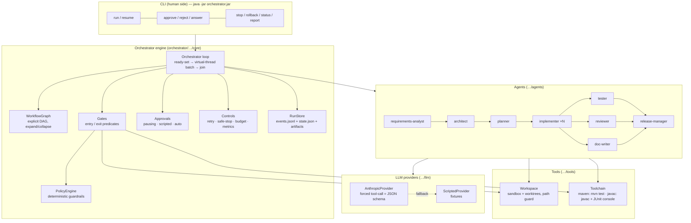
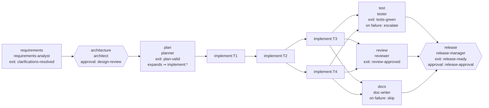
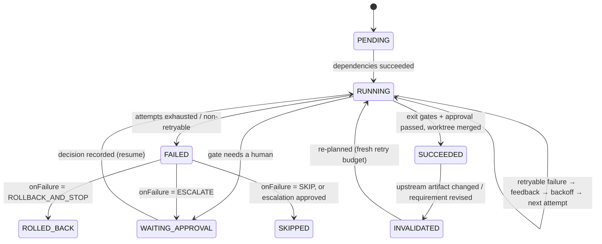

# Architecture overview

Two systems live in this repository. The **URL shortener** is the subject: a small, production-style Spring Boot service with real reliability features. The **orchestrator** is the point of the exercise: an engine that drives agents through the SDLC under explicit governance. They are separate Maven modules with no code dependency between them — the orchestrator only ever touches the service through a sandboxed copy of its files and its toolchain (`mvn` or `javac` + JUnit).

## 1. Components



### 1.1 The URL shortener (`url-shortener/`)

Hexagonal layout: web adapter → application service → domain → persistence port with two adapters.

| Layer | Package / class | Responsibility |
|---|---|---|
| Composition root | `UrlShortenerApplication`, `config/ShortenerConfig`, `config/ShortenerProperties` | Bean wiring (Clock, CodeGenerator, UrlPolicy, AnalyticsQueue, LinkService); typed, validated configuration bound from `shortener.*` |
| Web | `web/LinkController`, `web/RedirectController` | `@RestController`s; path templates constrain codes to `[A-Za-z0-9_-]{4,32}` |
| Web — cross-cutting | `web/ApiExceptionHandler`, `web/RequestIdFilter`, `web/RateLimitFilter` | `@RestControllerAdvice` with an **exhaustive switch** from `ErrorCode` to HTTP status (adding a code without a status does not compile); `X-Request-Id` correlation + MDC; per-IP fixed-window limiter on `/api/**` only |
| Application service | `domain/LinkService` | Use cases: create (idempotent), resolve + track, get, delete, stats; explicit validation; `java.time.Clock` injected |
| Domain | `domain/Link`, `LinkRules`, `RandomCodeGenerator`, `UrlPolicy`, `ErrorCode`, `DomainException` | Records; random base62 with rejection sampling and bounded collision retry; target-URL policy as a sealed `Ok | Rejected` result (scheme allowlist, credentials, private-network/metadata guard, self-reference guard, length cap) |
| Analytics | `analytics/AnalyticsQueue`, `ClickNormalizer` | Bounded, batched write-behind queue with retry/backoff, load shedding, graceful flush on `close()`; Micrometer gauges |
| Persistence port | `repository/LinkRepository` + `InMemoryLinkRepository`, `JdbcLinkRepository`, `SchemaMigrator` | Shared contract test suite; JDBC adapter on `JdbcTemplate` + `TransactionTemplate` with SQL in the H2/PostgreSQL common subset; versioned, idempotent in-code migration |
| Ops | `ops/StoreHealthIndicator`, Actuator | Readiness group includes the store; liveness stays up when the store is down; metrics endpoint |

Reliability features: rate limiting on the API surface (never on redirects), `Idempotency-Key` on create (table-backed, safe under concurrency), request-id correlation in logs and responses, graceful shutdown with queue flush (`server.shutdown=graceful` + `destroyMethod`), readiness that reflects the store, 302 + `Cache-Control: no-store` so analytics stays correct, HikariCP pool.

### 1.2 The orchestrator (`orchestrator/`)

| Package / class | Responsibility |
|---|---|
| `core/WorkflowGraph` | Explicit dependency graph. Validates at construction (unknown deps, cycles). `ready()` computes the runnable set; `expand()` turns the planner's tasks into real nodes wired by task dependencies and rewires dependents (fan-out/fan-in); `collapse()` is its inverse for re-planning; `downstream()` powers invalidation. |
| `core/Orchestrator` | The engine loop and stage runner: entry gates → agent → exit gates (in declared order) → stage approval → worktree merge → artifact with lineage. Retries with feedback, worktree rollback, failure policies, checkpoint pausing/resumption from the exact gate, invalidation, collapse/re-expansion, injected requirement revisions. Parallel batches run on **virtual threads** and join before the next decision. |
| `core/Gates` | Named deterministic predicates: `upstream-artifacts-present`, `workspace-ready`, `clarifications-resolved`, `plan-valid`, `policy-check`, `apply-patch`, `verify-patch` (none / typecheck / tests-red / tests-green), `tests-green`, `review-approved`, `release-ready`. |
| `core/PolicyEngine` | Guardrails on every patch: path allowlist, secrets, dangerous code, Maven dependency changes (parsed from `pom.xml`), protected files, change budget, bounded deletes, tests-accompany-source. Verdicts ALLOW / REQUIRE_APPROVAL / BLOCK; a rule that throws is a BLOCK. Never calls a model. |
| `core/Approvals` | `Pausing` (default: persist and wait for the CLI), `Scripted` (scenario-authored decisions incl. rejections and clarification answers, by request ordinal), `Auto` (demo; stamped `auto-approver`). |
| `core/Controls` | Exponential backoff; `SafeStop` (STOP file, shutdown hook, wall-clock/tool/LLM budgets); metrics finalisation (MTTR, latency, success rate). |
| `core/RunStore` | Event-sourced persistence: append-only `events.jsonl` written before the `state.json` snapshot; versioned artifacts with content hashes and `inputHashes` lineage. Synchronized for parallel stages. |
| `agents/*` | `Artifacts` (record contracts + explicit validation), eight `Agent<T>` implementations. Seven are model-backed through `Prompting.structuredCall`; the tester runs the real toolchain. |
| `llm/*` | `LlmProvider` seam; `AnthropicProvider` (plain `java.net.http`, forced tool call whose `input_schema` is the artifact's JSON schema from `resources/schemas/`); `ScriptedProvider` (`fixtures/<stage>[.attemptN].json`); `ProviderChain` (fallback, reported). |
| `tools/Workspace` | Sandboxed file system with a path guard, per-stage worktree `fork()`, conflict-checked `merge()`, snapshot/restore. |
| `tools/MavenToolchain`, `tools/JavacToolchain`, `tools/JUnitXml` | `mvn -o -q test-compile` / `mvn -o -q test` with surefire XML parsing; or javac + JUnit Platform console launcher against an explicit classpath (fast inner loop, and the only option without Maven Central). |
| `report/*` | Markdown and self-contained HTML run reports (inline-SVG DAG, metrics, checkpoints, full audit trail). |
| `scenario/*`, `cli/*`, `OrchestratorApplication` | Scenario model and loader, run factory (wiring), fixture builder; CLI `run`, `resume`, `approve`, `status`, `stop`, `rollback`, `report`, `fixtures`, `list`; Spring Boot shell (`java -jar`). |

## 2. Orchestration model

### 2.1 The workflow graph



Hexagons carry a human checkpoint. `implement` is a template node: after `plan` succeeds the graph is **expanded** into one node per planned task, wired by the plan's own dependencies (the shape above is the brownfield run). Tasks with no edge between them run concurrently; `test`, `review` and `docs` are three parallel branches that **join** at `release`.

### 2.2 Stage lifecycle



Each attempt of a stage that mutates the workspace runs in its own **worktree** (a copy of the main sandbox). Exit gates run there: `policy-check` on the patch, `apply-patch`, `verify-patch` (compile, or compile + tests). Only after every gate and the stage checkpoint pass is the patch **merged** into the main sandbox, with a conflict check against the file hashes recorded at fork time. A failed attempt discards its worktree; the main sandbox was never touched. This is what makes parallel implementation tasks safe (ADR-0004).

### 2.3 Control flow of the engine loop

```
loop:
  if safe-stop requested (STOP file, signal, budget) → persist, status=STOPPED, exit
  ready  = stages whose dependencies all succeeded/skipped and which are PENDING/READY/INVALIDATED
  if none ready and none running:
      any WAITING_APPROVAL   → status=PAUSED (CLI decides, `resume` continues)
      all SUCCEEDED/SKIPPED  → status=COMPLETED
      otherwise              → status=FAILED
  submit the ready batch to a virtual-thread executor; join
  post-process in order: failure policy (FAIL_RUN | ROLLBACK_AND_STOP | ESCALATE | SKIP),
                         success side effects (invalidate downstream on artifact change, expand the graph, apply injections)
```

Within a stage: entry gates → (fork worktree) → agent produces an artifact validated against its record contract → exit gates in order → stage-level approval → merge → store the artifact with lineage.

### 2.4 Human checkpoints

A gate can return `requiresApproval`. The engine asks the configured approver. If nobody decides (`Pausing`), the stage's **output and gate index are persisted** (`StageState.pending`), the run status becomes PAUSED, and the CLI prints what is needed. `approve` records the decision; `resume` continues **from the same gate with the same output** — the agent is not re-run, so what the human approved is exactly what proceeds. A rejection feeds the note back to the agent and a fresh attempt starts. Clarification checkpoints (`clarify-requirements`) carry questions; the answers become a `CLARIFICATIONS` artifact the requirements analyst consumes on its next attempt. Every approval record is consumed exactly once; a later request for the same gate creates a fresh record, so no stale approval can cover a different patch.

Checkpoints in the shipped workflow: `clarify-requirements` (blocking ambiguity), `design-review` (always), `policy:<stage>` (raised by policy rules: dependency change, protected file, change budget, source without tests), `escalate:<stage>` (a stage failed under ESCALATE), `release-approval` (always).

### 2.5 Re-planning

Two triggers, one mechanism:

1. **Upstream artifact changed.** When a stage succeeds and its artifact hash differs from the previous version, every succeeded stage downstream is marked INVALIDATED with the reason and re-runs with a fresh retry budget.
2. **Requirement revised mid-run** (`scenario.injections`). The requirement artifact is replaced, the root stage is invalidated, and everything downstream follows.

If the planner is among the invalidated stages, its dynamic expansion is **collapsed** (task nodes removed, template restored) so the new plan can expand a possibly different task graph. The ambiguous scenario exercises both: the graph is expanded twice with different shapes.

### 2.6 Context and lineage

Agents receive the latest version of the artifacts their stage consumes, the accumulated feedback for their stage (compiler output, test failures, policy messages, rejection notes, clarification answers), a repository map of the workspace, and the current contents of the files their task lists. Every stored artifact records `inputHashes` — the hashes of the artifacts it was derived from — and every event carries `stageId`, `attempt`, `actor` and a monotonically increasing `seq`. The report renders lineage per stage.

## 3. Key decisions

| # | Decision | Why | Alternative rejected |
|---|---|---|---|
| D1 | Governance is code, not prompts (ADR-0005). | A guardrail a model can be talked out of is not a guardrail; deterministic, testable, auditable. | "Ask the LLM if this is safe." |
| D2 | Explicit DAG with runtime expansion, not a fixed pipeline or a free-form agent loop. | Parallelism, joins and re-planning need a graph; expansion lets decomposition drive execution while the shape stays inspectable. | Linear chain; one planning agent calling tools ad hoc. |
| D3 | Per-attempt worktrees with merge-on-success (ADR-0004). | Parallel mutating stages on one tree corrupt each other; also makes rollback trivial and the main tree always consistent. | Serialising all mutating stages. |
| D4 | Structured outputs via forced tool-call + record contracts with explicit validation. | Invalid output becomes a retry with feedback, never a crash; the schema documents the artifact. | Free-text parsing. |
| D5 | Event-sourced run store: append the event, then snapshot. | The audit log can be ahead of the state but never behind it; resume after a crash is a load. | State-only persistence. |
| D6 | Fixtures authored as real Java files, assembled into JSON by the engine. | The three scenarios are reproducible offline including deliberate first-attempt failures, and the fixtures compile and run through the real toolchain. | Live-model only. |
| D7 | The tester is a tool. | Test results must be facts. | LLM "judging" test output. |
| D8 | Two toolchains behind one interface. | Maven is what reviewers trust; javac + JUnit console is the fast inner loop and the only option without Maven Central. | Maven only. |
| D9 | Service: exhaustive `switch` for error → status; JDBC not JPA; read-time expiry; bounded write-behind analytics; 302 + no-store; random base62. | See ADRs 0002/0003 and the brownfield architecture artifact. | Enum-with-status (loses the compile-time check that the brownfield scenario relies on); JPA for a two-table schema; sweepers; 301; counters. |
| D10 | Virtual threads for parallel stages. | Stages are I/O-bound (subprocesses, HTTP); a virtual thread per stage is the simplest correct model on Java 21. | Fixed pool. |

## 4. Observability

- `events.jsonl` — every state change, tool call, policy verdict, approval, fallback, fork, merge, rollback, re-plan.
- `state.json` — stages (status, attempts, feedback, lineage, pending checkpoint, worktree), artifacts (versions + hashes), approvals (who/when/why/consumed), metrics.
- `metrics.json` / report — stages succeeded, attempts, failure-driven retries, rollbacks, re-plans, approvals human/auto, policy findings/blocks, MTTR, end-to-end latency, per-stage latency, LLM calls and tokens, tool calls, attempt success rate.
- `report.html` — self-contained; DAG coloured by status, checkpoint table, full event table.

## 5. Security and change control

- Sandbox path guard: any patch path resolving outside the workspace throws before a write.
- Policy engine blocks secrets, dangerous code, out-of-allowlist paths, mass deletes; escalates Maven dependency changes, protected files, oversized patches and untested source changes to a human.
- No agent can approve anything; approvals come from the CLI, the scenario script, or the explicitly labelled auto mode.
- Bounded autonomy: retry budgets per stage, wall-clock/tool/LLM budgets per run, a STOP file honoured at every checkpoint, an initial snapshot for global rollback.
