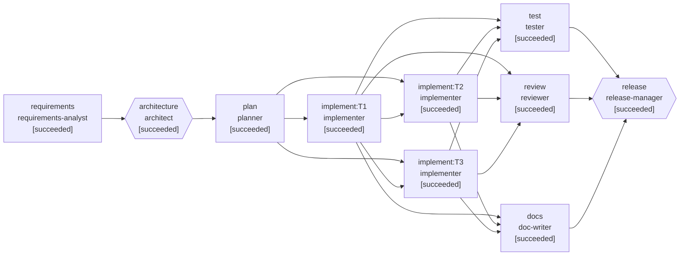

# Run report: Ambiguous: "our short links feel too easy to guess"

- **Run id:** `ambiguous`
- **Scenario:** ambiguous (ambiguous)
- **Status:** **COMPLETED**
- **Started / finished:** 2026-09-03T01:42:01.961795268Z → 2026-09-03T01:42:51.123164878Z
- **Final requirement:** Several users have told support that our short links "feel too easy to guess". Fix it. UPDATE from product after reviewing the tickets: half of the complaints are about custom aliases like 'sale1' and 'promo2', not generated codes. Also enforce a minimum length of 6 characters for custom aliases. Existing short aliases must keep working.

## Reliability metrics

| Metric | Value |
|---|---|
| Stages (succeeded / total) | 10 / 10 |
| Attempts / failure-driven retries | 15 / 2 |
| Attempt success rate | 87% |
| Rollbacks (discarded attempts) | 1 |
| Re-plans | 1 |
| Approvals requested (human / auto) | 5 (5 / 0) |
| Policy findings / blocks | 1 / 0 |
| MTTR (first failure → recovery) | 8925 ms |
| End-to-end latency | 49154 ms |
| LLM calls (in / out tokens) | 14 (34101 / 15913) |
| Tool calls | 10 |

## Workflow graph (final)

## Stage timeline

| Stage | Agent | Status | Attempts | Latency | Lineage (input hashes) | Notes |
|---|---|---|---|---|---|---|
| requirements | requirements-analyst | succeeded | 3 | 28 ms | - | re-planned: requirement revised: Product reviewed the support tickets after planning had started and widened the scope to custom aliases. |
| architecture | architect | succeeded | 2 | 26 ms | requirements-spec@d6619414 | re-planned: requirement revised: Product reviewed the support tickets after planning had started and widened the scope to custom aliases. |
| plan | planner | succeeded | 2 | 12 ms | requirements-spec@d6619414, architecture@942c74df | re-planned: requirement revised: Product reviewed the support tickets after planning had started and widened the scope to custom aliases. |
| implement:T1 | implementer | succeeded | 1 | 19060 ms | requirements-spec@d6619414, architecture@942c74df, task-plan@b61bb86a | - |
| implement:T2 | implementer | succeeded | 2 | 9027 ms | requirements-spec@d6619414, architecture@942c74df, task-plan@b61bb86a | - |
| implement:T3 | implementer | succeeded | 1 | 8920 ms | requirements-spec@d6619414, architecture@942c74df, task-plan@b61bb86a | - |
| test | tester | succeeded | 1 | 20284 ms | task-plan@b61bb86a | - |
| review | reviewer | succeeded | 1 | 100 ms | architecture@942c74df, task-plan@b61bb86a | - |
| docs | doc-writer | succeeded | 1 | 111 ms | requirements-spec@d6619414, architecture@942c74df | - |
| release | release-manager | succeeded | 1 | 29 ms | test-report@ea5f1785, review-report@be08ed95, architecture@942c74df | - |

## Human checkpoints

| Gate | Stage | Risk | Decision | By | Note / answers |
|---|---|---|---|---|---|
| clarify-requirements | requirements | medium | approve | scripted-stakeholder | The tickets are about generated codes being short (7 chars). Go with A: raise entropy of generated codes. Private/authenticated links are a separate product decision. — AMB-1=A |
| design-review | architecture | medium | approve | scripted-stakeholder | Agree with keeping the path pattern wide so legacy codes still resolve; the split between creation and resolution rules is the key design point. |
| policy:implement:T2 | implement:T2 | medium | reject | scripted-stakeholder | A changed default with no test pinning it will silently regress. Add a test asserting shortener.code-length binds to 8 before this lands. |
| release-approval | release | high | approve | scripted-stakeholder | Suite green including legacy-resolution tests; no breaking change for issued codes; alias rule change is documented in the CHANGELOG. Go. |

## Policy guardrails

| Stage | Rule | Verdict | Risk | Message |
|---|---|---|---|---|
| implement:T2 | tests-accompany-source | require-approval | medium | source changed without any test change |

## Failures, retries, rollbacks and re-plans

- `2026-09-03T01:42:02.369355100Z` **stage.retry-scheduled** (requirements): nextAttempt=2 backoffMs=50
- `2026-09-03T01:42:02.617579831Z` **replan.injected** : note=Product reviewed the support tickets after planning had started and widened the scope to custom aliases.
- `2026-09-03T01:42:02.621213716Z` **graph.collapsed** (implement): removed=[implement:T1, implement:T2]
- `2026-09-03T01:42:02.623331410Z` **replan.triggered** (requirements): reason=requirement revised: Product reviewed the support tickets after planning had started and widened the scope to custom aliases. invalidated=[architecture, plan]
- `2026-09-03T01:42:21.873283693Z` **stage.attempt-failed** (implement:T2 a1): error=approval rejected: A changed default with no test pinning it will silently regress. Add a test asserting shortener.code-length binds to 8 before this lands.
- `2026-09-03T01:42:21.876927992Z` **workspace.rollback** (implement:T2 a1): reason=attempt failed worktree=worktrees/implement_T2-a1
- `2026-09-03T01:42:21.877930611Z` **stage.retry-scheduled** (implement:T2): nextAttempt=2 backoffMs=100

## Requirement understanding

**Problem statement.** Users report short links feel guessable. Product reviewed the tickets: complaints cover both generated codes (7 chars) and short custom aliases ('sale1'). Harden both: newly generated codes become 8 base62 characters, and custom aliases must be at least 6 characters at creation. Nothing already issued may break: legacy 7-char codes and existing 4/5-char aliases must keep resolving, which means the creation-time alias rule and the path-resolution rule must be separated.

**Functional requirements**
- FR-1 (must): Newly generated codes are 8 base62 characters by default (configurable via shortener.code-length).
- FR-2 (must): All previously issued codes (7-char generated, custom aliases of any accepted length) keep resolving on GET /:code, metadata and stats.
- FR-3 (should): Collision handling (bounded retry) is unchanged.
- FR-4 (must): POST /api/links rejects customAlias shorter than 6 characters with 400 VALIDATION.
- FR-5 (must): Path resolution (GET /:code, /api/links/:code, /stats) still accepts 4-32 character codes so legacy aliases resolve.

**Acceptance criteria**
- AC-1: Given a valid URL, when POST /api/links without customAlias, then the code is 8 base62 characters
- AC-3: Given a legacy 7-char code exists in the store, when GET /:code, then 302 to its target
- AC-2: Given customAlias 'sale1', when POST /api/links, then 400; 'spring-sale' is accepted
- AC-3b: Given a legacy 4-char alias exists in the store, when GET /:code and GET /api/links/:code/stats, then 302 and 200 respectively

**Ambiguities identified**
- AMB-1: What does 'too easy to guess' mean for the users who complained? — options: A / B / C; recommended **A**; resolved: Stakeholder chose A, then product widened scope to B as well after reviewing tickets (requirement revised mid-run). C remains out of scope.
- AMB-2: Should already-issued codes be regenerated to the new rule? — options: no / yes; recommended **no**; resolved: No: never rotate issued codes.

**Assumptions**
- 'Guess' refers to an attacker or curious user finding links they were not given.
- No incident has occurred; this is preventive hardening.

**Risks**
- Building the wrong interpretation wastes an implementation cycle. (L:high/I:medium) → Blocking clarification before design.
- Tightening any pattern used by the routes breaks legacy codes. (L:medium/I:high) → Separate creation-time rules from path-resolution rules; acceptance test for legacy codes.
- The same regex currently validates aliases at creation AND appears in the controllers' path templates; raising the minimum in one place would 404 legacy aliases. (L:high/I:high) → Introduce LinkRules.CODE_PATH for the path templates, keep CUSTOM_ALIAS_REGEX for creation; acceptance test AC-3.

## Architecture & impact analysis

Two independent hardenings. (1) Generated code length: shortener.code-length 7 -> 8. (2) Custom alias minimum length 4 -> 6 at creation. The trap in (2): LinkRules.CUSTOM_ALIAS_REGEX validates aliases at creation, and the same 4-32 regex is hard-coded in the controllers' @GetMapping path templates; raising the creation minimum is fine, but tightening the path templates would make legacy 4/5-char aliases 404. Split: CUSTOM_ALIAS_REGEX (creation, 6-32) and a new LinkRules.CODE_PATH constant (resolution, 4-32) used by the controllers.

**Impacted modules**
- `src/main/java/dev/rajeev/shortener/config/ShortenerProperties.java` (modify): @DefaultValue 8.
- `src/main/resources/application.yml` (modify): shortener.code-length: 8 (explicit value overrides the record default).
- `src/main/java/dev/rajeev/shortener/domain/RandomCodeGenerator.java` (none): Parameterised by length.
- `src/main/java/dev/rajeev/shortener/web/LinkController.java` (none): Path template accepts 4-32; 8 fits.
- `src/test/java/dev/rajeev/shortener/web/ApiIntegrationTest.java` (modify): Assertion on code length.
- `src/test/java/dev/rajeev/shortener/config/ShortenerPropertiesTest.java` (create): Pin the bound default.
- `src/main/java/dev/rajeev/shortener/domain/LinkRules.java` (modify): Raise alias minimum to 6; add CODE_PATH for resolution.
- `src/main/java/dev/rajeev/shortener/domain/CreateLinkRequest.java` (modify): Validation message.
- `src/main/java/dev/rajeev/shortener/domain/LinkService.java` (modify): Validation message.
- `src/main/java/dev/rajeev/shortener/web/LinkController.java` (modify): Path templates use LinkRules.CODE_PATH.
- `src/main/java/dev/rajeev/shortener/web/RedirectController.java` (modify): Path template uses LinkRules.CODE_PATH.
- `src/test/java/dev/rajeev/shortener/web/GuessabilityIntegrationTest.java` (create): AC-1, AC-2, AC-3 acceptance tests.
- `src/test/java/dev/rajeev/shortener/domain/LinkServiceTest.java` (modify): Rule split unit test.

**Decisions**
- D-1: Raise entropy by length (8 chars) rather than by alphabet.. _Why:_ Base62 is already the largest URL-safe unambiguous alphabet; one more character multiplies the keyspace by 62.. _Alternatives:_ Base64url (adds - and _; marginal gain); Longer codes (10+). _Trade-offs:_ Slightly longer URLs.
- D-2: Separate the creation-time alias rule from the path-resolution rule (LinkRules.CUSTOM_ALIAS_REGEX vs LinkRules.CODE_PATH).. _Why:_ Issued codes are a contract; the resolution pattern must stay as wide as anything ever issued. Only creation gets stricter.. _Alternatives:_ Tighten one shared pattern (breaks legacy aliases); Migrate legacy aliases (rewrites shared URLs). _Trade-offs:_ Two patterns to keep in mind; documented in code comments and ADR.

**Rollback strategy.** Revert both; nothing issued under the new rules becomes unresolvable because the path templates are unchanged (4-32).

## Task decomposition

Three tasks after the scope change. T1 writes all acceptance tests (red). T2 (code length) and T3 (alias rule split) touch disjoint files and run in parallel in separate worktrees; each is compile-gated in isolation and the test stage proves the merged result.

| Task | Depends on | Verify | Risk | Files |
|---|---|---|---|---|
| T1: Red acceptance tests: 8-char codes, alias minimum 6, legacy codes resolve | - | tests-red | low | src/test/java/dev/rajeev/shortener/web/ApiIntegrationTest.java, src/test/java/dev/rajeev/shortener/web/GuessabilityIntegrationTest.java |
| T2: Raise the generated code length to 8 | T1 | typecheck | low | src/main/java/dev/rajeev/shortener/config/ShortenerProperties.java, src/main/resources/application.yml, src/test/java/dev/rajeev/shortener/config/ShortenerPropertiesTest.java |
| T3: Alias minimum length 6 with a separate path-resolution rule | T1 | typecheck | medium | src/main/java/dev/rajeev/shortener/domain/LinkRules.java, src/main/java/dev/rajeev/shortener/domain/CreateLinkRequest.java, src/main/java/dev/rajeev/shortener/domain/LinkService.java, src/main/java/dev/rajeev/shortener/web/LinkController.java, src/main/java/dev/rajeev/shortener/web/RedirectController.java, src/test/java/dev/rajeev/shortener/domain/LinkServiceTest.java |

_Sequencing:_ T2 and T3 share no files, so they fork separate worktrees and merge independently; the full suite runs once on the merged tree in the test stage.

## Verification

- Compile: ok
- Tests: 100/100 passed in 15385 ms → **green**

## Review

Verdict: **approve** — Both hardenings are minimal and backward compatible for issued codes. The creation/resolution pattern split is the important correctness point and is covered by acceptance test AC-3/3b. The rejected first attempt of T2 (no test) was corrected.

- [low/security] `src/main/java/dev/rajeev/shortener/domain/LinkRules.java`: Minimum alias length does not stop dictionary-word aliases ('summer', 'promos'). → Consider a denylist of common words or require a digit/hyphen; track as follow-up.
- [low/compliance] `src/main/java/dev/rajeev/shortener/web/LinkController.java`: customAlias rule change is breaking for API clients that create 4-5 char aliases. → Call it out in CHANGELOG and OpenAPI description (done in docs stage).
- [info/testing] `src/test/java/dev/rajeev/shortener/web/GuessabilityIntegrationTest.java`: Legacy-code test seeds the repository directly. → Appropriate: there is no API to create sub-6 aliases any more.

## Release readiness

Version 1.0.1 — **GO** (risk low: No data migration; resolution rules unchanged; one documented breaking validation rule for alias creation.)

- [x] Suite green including legacy-resolution tests — test-report
- [x] Review approved — review-report
- [x] Change-control rejection resolved (config test added) — policy:implement:T2 history
- [x] CHANGELOG notes the alias rule change — docs stage
- [x] Rollback plan documented

**Rollback plan**
1. Redeploy previous build.
2. No data changes to undo; 8-char codes issued meanwhile still resolve under the old build (pattern 4-32).

## Audit trail

149 events in `events.jsonl`. Every artifact records the hashes of the artifacts it was derived from (decision lineage); every approval records who decided and why.
