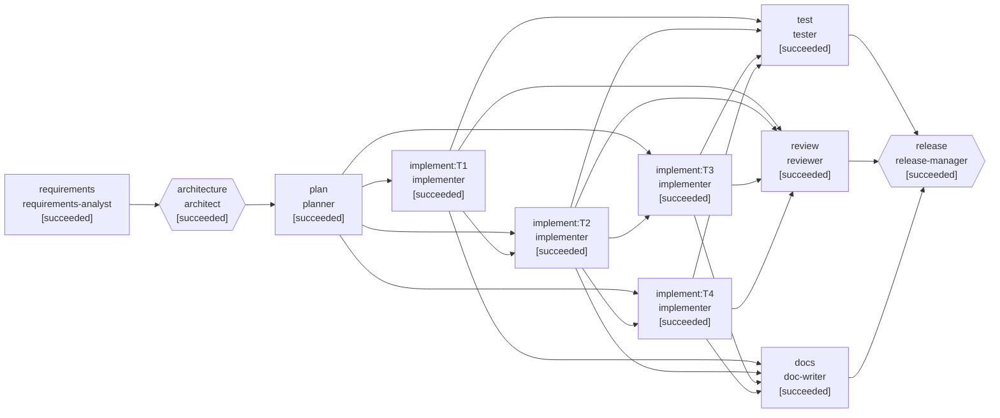

# Run report: Brownfield: add link expiry to the existing URL shortener

- **Run id:** `brownfield`
- **Scenario:** brownfield (brownfield)
- **Status:** **COMPLETED**
- **Started / finished:** 2026-09-03T01:40:38.019951555Z → 2026-09-03T01:41:58.572162615Z
- **Final requirement:** Marketing runs time-boxed campaigns and wants campaign links that stop working after the campaign ends. Add optional expiry to short links: callers can set an expiry when creating a link; expired links must stop redirecting and tell the client clearly that the link expired (not that it doesn't exist); click statistics must remain available after expiry. Existing links, clients and stored data must keep working unchanged.

## Reliability metrics

| Metric | Value |
|---|---|
| Stages (succeeded / total) | 11 / 11 |
| Attempts / failure-driven retries | 13 / 2 |
| Attempt success rate | 85% |
| Rollbacks (discarded attempts) | 2 |
| Re-plans | 0 |
| Approvals requested (human / auto) | 3 (3 / 0) |
| Policy findings / blocks | 2 / 1 |
| MTTR (first failure → recovery) | 15103 ms |
| End-to-end latency | 80537 ms |
| LLM calls (in / out tokens) | 12 (49800 / 34356) |
| Tool calls | 15 |

## Workflow graph (final)

## Stage timeline

| Stage | Agent | Status | Attempts | Latency | Lineage (input hashes) | Notes |
|---|---|---|---|---|---|---|
| requirements | requirements-analyst | succeeded | 1 | 168 ms | - | - |
| architecture | architect | succeeded | 1 | 80 ms | requirements-spec@8e574d1e | - |
| plan | planner | succeeded | 1 | 43 ms | requirements-spec@8e574d1e, architecture@6bd3ce43 | - |
| implement:T1 | implementer | succeeded | 1 | 22377 ms | requirements-spec@8e574d1e, architecture@6bd3ce43, task-plan@e62bdc13 | - |
| implement:T2 | implementer | succeeded | 2 | 5195 ms | requirements-spec@8e574d1e, architecture@6bd3ce43, task-plan@e62bdc13 | last error: exit gate 'policy-check' failed: policy blocked the patch: [path-allowlist] patch touches files outside the allowlist: . |
| implement:T3 | implementer | succeeded | 2 | 29938 ms | requirements-spec@8e574d1e, architecture@6bd3ce43, task-plan@e62bdc13 | last error: exit gate 'verify-patch' failed: compilation failed: |
| implement:T4 | implementer | succeeded | 1 | 9729 ms | requirements-spec@8e574d1e, architecture@6bd3ce43, task-plan@e62bdc13 | - |
| test | tester | succeeded | 1 | 22380 ms | task-plan@e62bdc13 | - |
| review | reviewer | succeeded | 1 | 121 ms | architecture@6bd3ce43, task-plan@e62bdc13 | - |
| docs | doc-writer | succeeded | 1 | 144 ms | requirements-spec@8e574d1e, architecture@6bd3ce43 | - |
| release | release-manager | succeeded | 1 | 30 ms | test-report@4a63e800, review-report@ca85f88c, architecture@6bd3ce43 | - |

## Human checkpoints

| Gate | Stage | Risk | Decision | By | Note / answers |
|---|---|---|---|---|---|
| design-review | architecture | medium | approve | scripted-stakeholder | Impact analysis matches the codebase; additive migration and read-time expiry check are the right calls. Proceed. |
| policy:implement:T3 | implement:T3 | medium | approve | scripted-stakeholder | Reviewed the ApiExceptionHandler diff: one case added to the exhaustive status switch (EXPIRED -> 410). No change to handler logic. |
| release-approval | release | high | approve | scripted-stakeholder | Green suite incl. upgrade tests, review approved, rollback plan is a code rollback with the additive column left in place. Go. |

## Policy guardrails

| Stage | Rule | Verdict | Risk | Message |
|---|---|---|---|---|
| implement:T2 | path-allowlist | block | high | patch touches files outside the allowlist: .env.local |
| implement:T3 | protected-files-require-approval | require-approval | medium | patch modifies protected files: src/main/java/dev/rajeev/shortener/web/ApiExceptionHandler.java |

## Failures, retries, rollbacks and re-plans

- `2026-09-03T01:41:01.084418059Z` **stage.attempt-failed** (implement:T2 a1): error=policy blocked the patch: [path-allowlist] patch touches files outside the allowlist: .env.local gate=policy-check
- `2026-09-03T01:41:01.090350539Z` **workspace.rollback** (implement:T2 a1): reason=exit gate 'policy-check' failed: policy blocked the patch: [path-allowlist] patch touches files outside the allowlist: .env.local worktree=worktrees/implement_T2-a1
- `2026-09-03T01:41:01.091741668Z` **stage.retry-scheduled** (implement:T2): nextAttempt=2 backoffMs=100
- `2026-09-03T01:41:11.037367468Z` **stage.attempt-failed** (implement:T3 a1): error=compilation failed: gate=verify-patch
- `2026-09-03T01:41:11.047553379Z` **workspace.rollback** (implement:T3 a1): reason=exit gate 'verify-patch' failed: compilation failed: worktree=worktrees/implement_T3-a1
- `2026-09-03T01:41:11.053477047Z` **stage.retry-scheduled** (implement:T3): nextAttempt=2 backoffMs=100

## Requirement understanding

**Problem statement.** Extend the existing URL shortener (Spring Boot 3 / Java 21, JdbcTemplate over H2/PostgreSQL, batched analytics queue, soft delete) so that a short link can carry an optional hard expiry. After the expiry instant, redirect and metadata requests must fail with a distinct 'expired' outcome (410 EXPIRED) rather than 'not found' or 'deleted', while click statistics remain readable. The change must be backward compatible for existing rows (no expiry), existing API clients (field is optional) and the persisted schema (additive migration).

**Functional requirements**
- FR-1 (must): POST /api/links accepts an optional expiresAt (ISO-8601 instant, must be in the future); the created link records it.
- FR-2 (must): Every link response (create, metadata, idempotent replay) includes expiresAt, null when the link never expires.
- FR-3 (must): GET /:code and GET /api/links/:code return HTTP 410 with error code EXPIRED once now >= expiresAt.
- FR-4 (must): GET /api/links/:code/stats keeps returning analytics for expired links.
- FR-5 (must): Links created without expiresAt behave exactly as today.
- FR-6 (must): Existing H2/PostgreSQL databases are migrated in place (schema_version 1 -> 2) without data loss.
- FR-7 (should): openapi.yaml reflects the new field and the 410 EXPIRED outcome.

**Acceptance criteria**
- AC-1: Given a valid URL and an expiresAt one hour in the future, when POST /api/links is called, then 201 is returned and the response echoes expiresAt
- AC-2: Given an expiresAt in the past, when POST /api/links is called, then 400 VALIDATION is returned and nothing is stored
- AC-3: Given a link created without expiresAt, when it is created and redirected, then expiresAt is null and the redirect is a 302 as before
- AC-4: Given a link whose expiresAt has passed, when GET /:code or GET /api/links/:code is called, then 410 with error EXPIRED is returned
- AC-5: Given a link that was clicked and then expired, when GET /api/links/:code/stats is called, then 200 with the recorded clicks is returned
- AC-6: Given a database created by schema v1, when the service opens it, then the schema is upgraded to v2, legacy rows read back with expiresAt null, and re-opening is idempotent

**Ambiguities identified**
- AMB-1: Should an expired link return 410 Gone (same status as deleted, different error code) or 404? — options: 410-EXPIRED / 404; recommended **410-EXPIRED**; resolved: 410 with error code EXPIRED — the requirement explicitly asks for a distinct outcome.
- AMB-2: Absolute expiresAt or relative ttlSeconds in the request? — options: expiresAt / ttlSeconds; recommended **expiresAt**; resolved: expiresAt; a ttl convenience can be added later without breaking the contract.

**Assumptions**
- Expiry is a hard cut-off evaluated against the server clock; no grace period.
- Expired links are not purged; they stay soft-present so codes are never reissued and stats remain.
- There is no requirement to extend or edit expiry after creation (would need a PATCH endpoint; out of scope).
- Callers supply absolute instants (expiresAt, ISO-8601) rather than durations; a ttl convenience can be layered on later.

**Risks**
- ApiExceptionHandler.statusFor is an exhaustive switch expression over ErrorCode; adding a code without a case fails compilation. (L:medium/I:low) → Compile gate on every implementation task.
- Schema change on a live database. (L:low/I:high) → Additive nullable column, idempotent migration guarded by schema_version, upgrade tests against a v1 database.
- Clock skew between API instances makes expiry appear inconsistent for a few seconds. (L:medium/I:low) → Document; acceptable for campaign links. NTP on hosts.

## Architecture & impact analysis

Expiry is a property of the Link record, enforced at read time inside LinkService.resolve() so every read path (redirect, metadata) inherits it and the analytics path (stats) deliberately bypasses it. Persistence is an additive nullable column with an idempotent v1->v2 migration in SchemaMigrator; the in-memory adapter needs no change beyond carrying the field. The web layer only needs the EXPIRED -> 410 case in the exhaustive status switch.

**Impacted modules**
- `src/main/java/dev/rajeev/shortener/domain/Link.java` (modify): Add expiresAt component, expiredAt(now), keep withDeletedAt carrying it.
- `src/main/java/dev/rajeev/shortener/domain/CreateLinkRequest.java` (modify): Optional expiresAt (Instant, ISO-8601 via Jackson jsr310).
- `src/main/java/dev/rajeev/shortener/domain/LinkResponse.java` (modify): Expose expiresAt on every link response (null when absent).
- `src/main/java/dev/rajeev/shortener/domain/ErrorCode.java` (modify): Add EXPIRED.
- `src/main/java/dev/rajeev/shortener/domain/LinkService.java` (modify): Store expiresAt; reject past values; enforce in resolve() via the injected Clock so unit tests can move time.
- `src/main/java/dev/rajeev/shortener/repository/SchemaMigrator.java` (modify): v2 migration, CURRENT_VERSION = 2.
- `src/main/java/dev/rajeev/shortener/repository/JdbcLinkRepository.java` (modify): Column in INSERT/SELECT and row mapping.
- `src/main/java/dev/rajeev/shortener/repository/LinkRepository.java` (none): Port unchanged: the Link record carries the field.
- `src/main/java/dev/rajeev/shortener/web/ApiExceptionHandler.java` (modify): statusFor is an exhaustive switch; EXPIRED -> GONE (410). Protected file: reviewer approval required.
- `src/main/java/dev/rajeev/shortener/web/RedirectController.java` (none): resolveAndTrack() inherits the check.
- `src/test/java/dev/rajeev/shortener/repository/LinkRepositoryContractTest.java` (modify): Link fixture gains expiresAt; persistence assertion for both adapters.
- `src/test/java/dev/rajeev/shortener/domain/LinkServiceTest.java` (modify): Fake-clock tests for create/resolve/stats behaviour.
- `src/test/java/dev/rajeev/shortener/web/ExpiryIntegrationTest.java` (create): Acceptance tests AC-1..AC-5 written before implementation.
- `src/test/java/dev/rajeev/shortener/repository/SchemaUpgradeTest.java` (create): AC-6: v1 database upgraded in place, idempotent.

**Decisions**
- D-1: Evaluate expiry at read time in LinkService.resolve(), not with a background sweeper.. _Why:_ Zero new infrastructure, exact semantics, one comparison on the hot path. The injected java.time.Clock keeps it unit-testable.. _Alternatives:_ Cron/sweeper that soft-deletes expired rows; Database-level TTL. _Trade-offs:_ Expired rows persist (by requirement, stats must survive). A future purge job can be added independently.
- D-2: Additive nullable column with an idempotent in-code migration guarded by schema_version.. _Why:_ Safe on a live database; v1 code ignores the column so a code rollback needs no schema rollback (NFR-3). Idempotent via INFORMATION_SCHEMA check, same on H2 and PostgreSQL.. _Alternatives:_ Separate link_expiry table; Rebuild table. _Trade-offs:_ Migrations live in code rather than a migration tool; acceptable at this scale, documented as a limitation.
- D-3: Validate 'future only' in LinkService against the injected Clock, mapped to 400 VALIDATION.. _Why:_ One place for the rule regardless of caller; the fake clock in tests covers it. Bean Validation has no future-relative-to-injected-clock constraint.. _Alternatives:_ @Future on the request record (wall clock, not injectable). _Trade-offs:_ Validation happens after body binding rather than by annotation; same HTTP outcome.
- D-4: Distinct error code EXPIRED mapped to HTTP 410.. _Why:_ Requirement asks for a clear 'expired' signal; 410 already means 'intentionally gone'. Clients branch on the error code.. _Alternatives:_ 404; Custom 4xx. _Trade-offs:_ Two error codes share a status; documented in openapi.yaml.

**Rollback strategy.** Deploy the previous build. The expires_at column stays (nullable, ignored by v1); schema_version=2 is harmless because v1 only inserts the row if missing. Links created with an expiry would stop expiring under v1 — acceptable for a short rollback window; note it in the release checklist.

## Task decomposition

Four tasks in TDD order. T1 writes the acceptance tests and must be red. T2 lands the domain model and persistence (compile-gated; the suite is expected to stay red until T3). T3 and T4 both depend on T2 and run in parallel: T3 wires enforcement and the HTTP mapping and must turn the suite green; T4 adds upgrade tests for the migration path.

| Task | Depends on | Verify | Risk | Files |
|---|---|---|---|---|
| T1: Write failing acceptance tests for expiry | - | tests-red | low | src/test/java/dev/rajeev/shortener/web/ExpiryIntegrationTest.java |
| T2: Domain model and persistence for expiresAt | T1 | typecheck | medium | src/main/java/dev/rajeev/shortener/domain/Link.java, src/main/java/dev/rajeev/shortener/domain/CreateLinkRequest.java, src/main/java/dev/rajeev/shortener/domain/LinkResponse.java, src/main/java/dev/rajeev/shortener/domain/LinkService.java, src/main/java/dev/rajeev/shortener/repository/SchemaMigrator.java, src/main/java/dev/rajeev/shortener/repository/JdbcLinkRepository.java, src/test/java/dev/rajeev/shortener/repository/LinkRepositoryContractTest.java, src/test/java/dev/rajeev/shortener/repository/SchemaMigratorTest.java, src/test/java/dev/rajeev/shortener/domain/LinkServiceTest.java |
| T3: Enforce expiry in the service and map it through the API | T2 | tests-green | medium | src/main/java/dev/rajeev/shortener/domain/ErrorCode.java, src/main/java/dev/rajeev/shortener/domain/LinkService.java, src/main/java/dev/rajeev/shortener/web/ApiExceptionHandler.java, src/test/java/dev/rajeev/shortener/domain/LinkServiceTest.java |
| T4: Upgrade tests for the v1 -> v2 migration path | T2 | typecheck | low | src/test/java/dev/rajeev/shortener/repository/SchemaUpgradeTest.java |

_Sequencing:_ T1 first so the feature is specified executably. T2 is the shared foundation. T3 and T4 are independent once T2 exists, so they run in parallel in separate worktrees and join at the test stage, which runs the complete suite once on the merged tree.

## Verification

- Compile: ok
- Tests: 106/106 passed in 17090 ms → **green**

## Review

Verdict: **approve** — Change is small, additive and well-tested. Expiry is enforced in one place (LinkService.resolve) and inherited by both read paths; stats intentionally bypass it. Migration is additive and idempotent with upgrade tests against a v1 database. The only protected-file change (ApiExceptionHandler) is a single switch case.

- [low/correctness] `src/main/java/dev/rajeev/shortener/domain/LinkService.java`: validateExpiry runs after the idempotency short-circuit, so a replayed request with a now-past expiresAt still returns the original link. → Intended: idempotent replays must return the original outcome. Document it.
- [low/maintainability] `src/main/java/dev/rajeev/shortener/repository/SchemaMigrator.java`: Migrations are hand-rolled inside the repository. → Fine at v2; move to Flyway before v4.
- [info/testing] `src/test/java/dev/rajeev/shortener/web/ExpiryIntegrationTest.java`: AC-4/AC-5 use real sleeps (1.2 s). → Inject a Clock bean override for integration tests to remove wall-clock waits.
- [info/compliance] `src/main/java/dev/rajeev/shortener/web/ApiExceptionHandler.java`: Protected file modified. → Diff reviewed: `case GONE, EXPIRED -> HttpStatus.GONE`. No handler logic changed. Approved via policy:implement:T3 checkpoint.

## Release readiness

Version 1.1.0 — **GO** (risk low: Backward-compatible API (optional field), additive schema, read-time enforcement with no new infrastructure, full suite green including migration tests.)

- [x] Typecheck and full test suite green — test-report: green
- [x] Security/quality review approved — review-report: approve, no high/critical findings
- [x] Protected-file change approved by a human — policy:implement:T3 approval
- [x] Schema migration is additive and tested — src/test/java/dev/rajeev/shortener/repository/SchemaUpgradeTest.java
- [x] openapi.yaml updated for expiresAt and 410 EXPIRED — docs stage patch
- [x] CHANGELOG and README updated — docs stage patch
- [x] Rollback plan documented — this checklist

**Rollback plan**
1. Redeploy the previous build (v1.0.0).
2. Leave the expires_at column and schema_version=2 in place; v1 ignores both.
3. Communicate that links created with an expiry during the window will not expire under v1 until roll-forward.
4. Roll forward once the issue is fixed; the migration is idempotent so no manual schema work is needed.

## Audit trail

143 events in `events.jsonl`. Every artifact records the hashes of the artifacts it was derived from (decision lineage); every approval records who decided and why.
