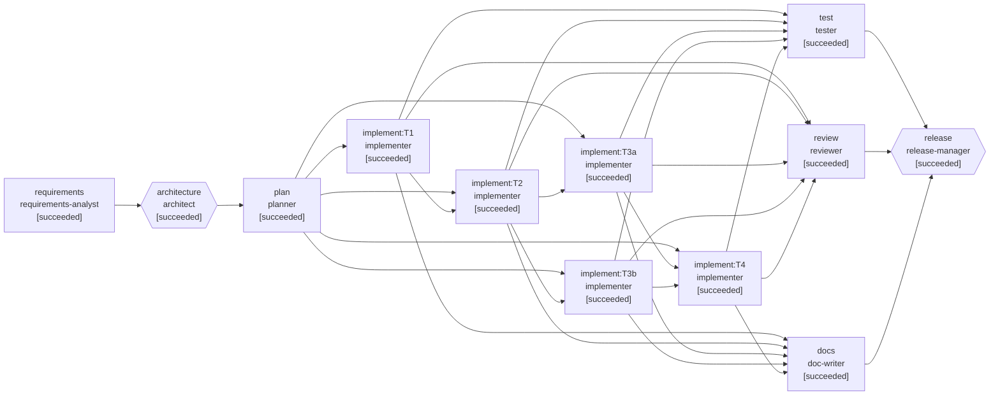

# Run report: Greenfield: build a URL shortener from an empty workspace

- **Run id:** `greenfield`
- **Scenario:** greenfield (greenfield)
- **Status:** **COMPLETED**
- **Started / finished:** 2026-09-03T01:39:51.601062701Z → 2026-09-03T01:40:34.458103208Z
- **Final requirement:** Build a URL shortener service. Users submit a long URL and get back a short link; visiting the short link redirects to the original. We want to see how many times each link was clicked. It should be safe to expose on the internet and easy to run locally.

## Reliability metrics

| Metric | Value |
|---|---|
| Stages (succeeded / total) | 12 / 12 |
| Attempts / failure-driven retries | 12 / 0 |
| Attempt success rate | 100% |
| Rollbacks (discarded attempts) | 0 |
| Re-plans | 0 |
| Approvals requested (human / auto) | 3 (3 / 0) |
| Policy findings / blocks | 1 / 0 |
| MTTR (first failure → recovery) | no failures |
| End-to-end latency | 42850 ms |
| LLM calls (in / out tokens) | 11 (11832 / 8194) |
| Tool calls | 14 |

## Workflow graph (final)

## Stage timeline

| Stage | Agent | Status | Attempts | Latency | Lineage (input hashes) | Notes |
|---|---|---|---|---|---|---|
| requirements | requirements-analyst | succeeded | 1 | 104 ms | - | - |
| architecture | architect | succeeded | 1 | 82 ms | requirements-spec@46e4925b | - |
| plan | planner | succeeded | 1 | 55 ms | requirements-spec@46e4925b, architecture@61359cc9 | - |
| implement:T1 | implementer | succeeded | 1 | 76 ms | requirements-spec@46e4925b, architecture@61359cc9, task-plan@f6fc3fe0 | - |
| implement:T2 | implementer | succeeded | 1 | 11117 ms | requirements-spec@46e4925b, architecture@61359cc9, task-plan@f6fc3fe0 | - |
| implement:T3a | implementer | succeeded | 1 | 5193 ms | requirements-spec@46e4925b, architecture@61359cc9, task-plan@f6fc3fe0 | - |
| implement:T3b | implementer | succeeded | 1 | 5251 ms | requirements-spec@46e4925b, architecture@61359cc9, task-plan@f6fc3fe0 | - |
| implement:T4 | implementer | succeeded | 1 | 12837 ms | requirements-spec@46e4925b, architecture@61359cc9, task-plan@f6fc3fe0 | - |
| test | tester | succeeded | 1 | 13040 ms | task-plan@f6fc3fe0 | - |
| review | reviewer | succeeded | 1 | 43 ms | architecture@61359cc9, task-plan@f6fc3fe0 | - |
| docs | doc-writer | succeeded | 1 | 126 ms | requirements-spec@46e4925b, architecture@61359cc9 | - |
| release | release-manager | succeeded | 1 | 29 ms | test-report@9397b513, review-report@33afe13f, architecture@61359cc9 | - |

## Human checkpoints

| Gate | Stage | Risk | Decision | By | Note / answers |
|---|---|---|---|---|---|
| design-review | architecture | medium | approve | scripted-stakeholder | Ports-and-adapters with an in-memory store is right for v0; a JDBC adapter can slot behind LinkStore. Proceed. |
| policy:implement:T1 | implement:T1 | high | approve | scripted-stakeholder | Dependencies reviewed: spring-boot-starter-web (runtime), spring-boot-starter-test (test), both managed by spring-boot-starter-parent 3.4.4 already used in the org. |
| release-approval | release | high | approve | scripted-stakeholder | v0 acceptance suite green, review approved, in-memory store documented as a v0 limitation. Go for internal preview. |

## Policy guardrails

| Stage | Rule | Verdict | Risk | Message |
|---|---|---|---|---|
| implement:T1 | dependency-change-requires-approval | require-approval | high | dependency changes detected: +org.springframework.boot:spring-boot-starter-web, +org.springframework.boot:spring-boot-starter-test |

## Failures, retries, rollbacks and re-plans

_Clean run: no retries, rollbacks or re-plans._

## Requirement understanding

**Problem statement.** Build a minimal, internet-safe URL shortener as a Spring Boot 3 / Java 21 HTTP service: create a short code for an absolute http(s) URL, redirect visitors of the short code to the original URL while counting the click, expose per-link click statistics, and provide a health endpoint. v0 runs locally with no external dependencies; persistence is in-memory behind a storage port so a JDBC store can be added without touching the HTTP layer.

**Functional requirements**
- FR-1 (must): POST /api/links with {url} returns 201 with a 7-character base62 code and the full short URL.
- FR-2 (must): GET /:code redirects (302) to the original URL and records a click.
- FR-3 (must): GET /api/links/:code/stats returns the click count and last click time.
- FR-4 (must): Only absolute http/https URLs are accepted; anything else is a 400.
- FR-5 (must): Unknown codes return 404 on redirect and stats.
- FR-6 (should): GET /health returns {status:'ok'} for load balancers.

**Acceptance criteria**
- AC-1: Given a valid https URL, when POST /api/links, then 201 with a 7-char base62 code and shortUrl = baseUrl/code
- AC-2: Given javascript:, ftp:, malformed or empty URL, when POST /api/links, then 400
- AC-3: Given an existing code, when GET /:code, then 302 with Location = original URL
- AC-4: Given an unknown code, when GET /:code, then 404
- AC-5: Given a code clicked twice, when GET /api/links/:code/stats, then 200 with clicks=2 and a lastClickAt timestamp
- AC-6: Given the service is up, when GET /health, then 200 {status:'ok'}

**Ambiguities identified**
- AMB-1: What does 'how many times each link was clicked' need to include? — options: count+last / breakdown; recommended **count+last**; resolved: count+last for v0; breakdowns tracked as a follow-up.
- AMB-2: Does 'safe to expose on the internet' require rate limiting in v0? — options: no / yes; recommended **no**; resolved: Not in v0; recorded as a risk with a mitigation plan.

**Assumptions**
- No authentication in v0; anyone can create links (rate limiting is a v1 concern and is noted as a risk).
- 'How many times clicked' means a total count plus last click time; referrer/UA breakdowns are v1.
- 'Safe to expose' means: scheme allowlist on targets, random codes, no caching of redirects, schema-validated input.
- In-memory persistence is acceptable for v0 as long as the storage port makes replacement straightforward.

**Risks**
- Open redirect abuse (phishing links). (L:medium/I:medium) → Scheme allowlist now; denylist/reputation checks and rate limiting in v1.
- In-memory store loses data on restart. (L:high/I:low) → Documented v0 limitation; storage port + contract test make SQLite/Postgres a contained change.
- Code collisions as the keyspace fills. (L:low/I:low) → 62^7 keys, collision check with bounded retry.

## Architecture & impact analysis

Small hexagonal service: an HTTP adapter (Spring MVC @RestController) over a storage port (LinkStore) with an in-memory adapter, and a pure code-generation class. The controller owns validation and status codes; the store owns links and click counters; Codes owns randomness. Tests boot the real context on a random port and use java.net.http.

**Impacted modules**
- `pom.xml` (create): spring-boot-starter-parent 3.4.4, starter-web, starter-test.
- `src/main/java/demo/App.java` (create): Entrypoint.
- `src/main/java/demo/LinkController.java` (create): HTTP adapter.
- `src/main/java/demo/LinkStore.java` (create): Storage port and in-memory adapter.
- `src/main/java/demo/Codes.java` (create): Short-code generation.
- `src/test/java/demo/AppTest.java` (create): Acceptance tests AC-1..AC-6.
- `src/test/java/demo/LinkStoreTest.java` (create): Store contract.
- `src/test/java/demo/CodesTest.java` (create): Alphabet, bias, collision retry.

**Decisions**
- D-1: Random base62 codes (7 chars) instead of an encoded counter.. _Why:_ Counters are enumerable; random codes with a collision check are not. 62^7 ≈ 3.5e12 keys.. _Alternatives:_ Base62(auto-increment); Hash of URL. _Trade-offs:_ Needs an existence check per create; negligible at v0 scale.
- D-2: 302 + Cache-Control: no-store for redirects.. _Why:_ 301 is cached by browsers, which would hide repeat clicks from analytics.. _Alternatives:_ 301; 307. _Trade-offs:_ Slightly more traffic to the service; acceptable, analytics is a requirement.
- D-3: Storage behind a LinkStore port with an in-memory adapter.. _Why:_ Zero-setup local run now; JDBC/Postgres later without touching the controller.. _Alternatives:_ H2 + JdbcTemplate from day one. _Trade-offs:_ Data lost on restart in v0 (documented).
- D-4: Validate URLs explicitly in the controller with a scheme allowlist.. _Why:_ javascript:/data: targets would make the redirect an XSS vector.. _Alternatives:_ Accept any parseable URI. _Trade-offs:_ None material.

**Rollback strategy.** v0 is a new service: rollback is stopping the process. No data migration exists.

## Task decomposition

Five tasks. T1 scaffolds the Maven project (the pom needs a human sign-off on dependencies). T2 writes the acceptance suite plus a compile-only App stub and must be red. T3a (codes) and T3b (store) are independent and run in parallel. T4 wires the controller and must turn the suite green.

| Task | Depends on | Verify | Risk | Files |
|---|---|---|---|---|
| T1: Project scaffold | - | none | medium | pom.xml |
| T2: Acceptance tests (red) and App stub | T1 | tests-red | low | src/test/java/demo/AppTest.java, src/main/java/demo/App.java |
| T3a: Short-code generation | T2 | typecheck | low | src/main/java/demo/Codes.java, src/test/java/demo/CodesTest.java |
| T3b: Storage port and in-memory adapter | T2 | typecheck | low | src/main/java/demo/LinkStore.java, src/test/java/demo/LinkStoreTest.java |
| T4: HTTP adapter | T3a, T3b | tests-green | medium | src/main/java/demo/LinkController.java |

_Sequencing:_ Scaffold first (nothing compiles without it), tests second so the target is executable, the two pure classes in parallel because they share nothing, and the controller last so 'green' means the acceptance criteria are met.

## Verification

- Compile: ok
- Tests: 11/11 passed in 9452 ms → **green**

## Review

Verdict: **approve** — Clean v0. Clear separation between HTTP, storage and codegen; validation at the edge; redirects are analytics-safe. Test coverage matches the acceptance criteria one-to-one.

- [medium/security] `src/main/java/demo/LinkController.java`: No rate limiting on POST /api/links; an open create endpoint can be used to mint phishing links at volume. → Track as v1 item alongside durable storage (per-IP limiter, e.g. Bucket4j).
- [low/security] `src/main/java/demo/LinkController.java`: validateUrl accepts private-network and localhost targets. → Add a private-IP / localhost guard before any server-side fetching of targets is introduced.
- [low/maintainability] `src/main/java/demo/LinkController.java`: The controller instantiates its own LinkStore instead of receiving a bean. → Make LinkStore a @Bean once a second adapter exists.
- [info/maintainability] `src/main/java/demo/LinkStore.java`: Contract tests only run against the in-memory adapter. → Turn LinkStoreTest into an abstract contract when a JDBC adapter lands.

## Release readiness

Version 0.1.0 — **GO** (risk low: New internal-preview service, no data migration, suite green, review approved with v1 follow-ups (rate limiting, private-IP guard) recorded.)

- [x] Acceptance suite green — test-report: green
- [x] Review approved; medium finding tracked as v1 work — review-report
- [x] Dependencies approved by a human — policy:implement:T1
- [x] README documents run/test and v0 limitations — docs stage
- [x] Rollback plan documented

**Rollback plan**
1. Stop the process.
2. No persistent state to clean up in v0.

## Audit trail

134 events in `events.jsonl`. Every artifact records the hashes of the artifacts it was derived from (decision lineage); every approval records who decided and why.
